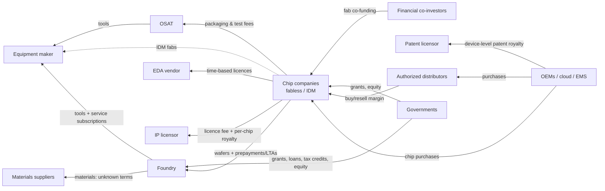

# Money flows: who pays whom, for what, and who carries the risk

> Scope: payments between the major participant types, the commercial basis of each, and where working capital and risk sit. Period: company figures are FY2025 or FY2026 as labelled; market figures are 2025. Geography: global.
> Built from research unit RU-0001 (mainly the money lens). Planner run `plan0-9c2e`.

**Evidence status.** All claims are unverified (low confidence). Every margin or ratio below comes from **one company in one fiscal year**. None of them is a category average. Rows marked **unknown** have no evidence and have not been filled in.

## What this means

Money in this industry flows *upstream*, from buyers of end products back towards the chip designers, foundries, equipment makers and materials suppliers. Three things make it unusual:

1. **Capacity is paid for before it is used.** Chip designers pay foundries deposits or prepayments to reserve capacity [CLM-0169] [CLM-0188].
2. **Some suppliers keep earning after the sale.** IP licensors are paid a royalty on every chip shipped [CLM-0213], and equipment makers earn from service on tools already installed [CLM-0509].
3. **Governments are now direct payers and even shareholders.** They pay grants and tax credits, and in one case took equity [CLM-0283] [CLM-0281] [CLM-0259].

## Why it matters

Who pays in advance, who holds inventory and who carries unused capacity determines who suffers in a downturn. The market fell 8.2% in 2023 [CLM-0287] and memory fell about 29% [CLM-0291]. It then rose 25.6% in 2025 [CLM-0293].

## How it works

### Payment edges

| Payer → payee | For what | Commercial basis | When / risk | Status and evidence |
|---|---|---|---|---|
| Fabless → foundry | Wafers made to the customer's design | Long-term agreements that reserve capacity; prepayments ("temporary receipts") and deposits. **Unit of price (per wafer? per good die?) unknown** | Paid in advance. Fabless firms take on non-cancellable orders | Evidenced [CLM-0169] [CLM-0175] [CLM-0176] [CLM-0188] [CLM-0189]. Price basis **unknown** [CLM-0174] |
| IDM → foundry | Overflow or outsourced wafers | Not specifically evidenced | | Relationship evidenced [CLM-0486]; terms **unknown** |
| Fabless / IDM → OSAT | Packaging and test of consigned wafers | Service fee. Customer keeps title and bears unused materials; no binding volumes | OSAT carries fixed cost and utilisation risk | Evidenced [CLM-0232] [CLM-0233] [CLM-0234] [CLM-0235]. Pricing unit **unknown** (INT-0008) |
| Chip designers → EDA vendor | Design software | Time-based licences plus subscriptions, some upfront, plus maintenance | Recurring, much of it from backlog | Evidenced [CLM-0199] [CLM-0210] [CLM-0212]. Seat prices **unknown** (INT-0009) |
| Chip designers → IP licensor | Design blocks | Licence fee (per design or multi-year) plus royalty per chip shipped | Royalties arrive years after licensing | Evidenced [CLM-0200] [CLM-0213]. Royalty rates **unknown** |
| Device OEMs → patent licensor | Patent rights | Percentage of the device's wholesale price, paid quarterly | | Evidenced [CLM-0196] [CLM-0197] |
| Foundries / IDMs / OSATs → equipment makers | Tools, then service, spares and upgrades | Capital purchase plus service subscriptions (more than two-thirds of AMAT service revenue) | Tool makers hold backlogs (ASML €38.8bn end-2025) | Evidenced [CLM-0229] [CLM-0230] [CLM-0224] [CLM-0513]. Customer down payments **unknown** [CLM-0225] |
| Fabs → materials, wafer, gas and chemical suppliers | Consumables | **unknown** | **unknown** | Market size evidenced (US$73.2bn in 2025) [CLM-0519]; contract terms **unknown** (INT-0019) |
| Chipmakers → distributors → OEMs/EMS | Components | Distributor buys and resells for a margin. Suppliers protect it against price erosion and obsolescence | Distributor holds inventory, but the supplier carries price risk | Evidenced [CLM-0270] [CLM-0273] [CLM-0276]. Ship-and-debit mechanics **unknown** [CLM-0277] (INT-0007) |
| OEMs / cloud providers → chip companies | Chips | Direct or via distributors | | Evidenced [CLM-0245] [CLM-0274] |
| Chip company → cloud providers | Cloud capacity | Multi-year cloud service agreements (US$27.0bn at NVIDIA) | | Evidenced [CLM-0193]; purpose **unknown** |
| US government → fabs | Grants, loans, tax credits | Milestone-reimbursed grants; 35% investment tax credit with direct pay | Paid after investment | Evidenced [CLM-0283] [CLM-0284] [CLM-0278] [CLM-0281] |
| US government → Intel | Equity (9.9%) | Unpaid CHIPS grants converted into shares | | Evidenced [CLM-0259] [CLM-0260] |
| EU member states → fabs | State aid | Approved by the Commission under the Chips Act | | Evidenced [CLM-0172] [CLM-0329] |
| Japan, Korea, China, Taiwan, India → fabs/designers | Grants, tax credits, fund equity | Programme-level facts only | | Programmes evidenced [CLM-0340] [CLM-0354] [CLM-0350] [CLM-0356] [CLM-0358]. Amounts per recipient **unknown** [CLM-0285] |
| Financial co-investors → IDM fabs | Share of fab capex | Minority stakes (Intel SCIP) | | Evidenced [CLM-0257]; terms **unknown** |

### Sampled economics (one company each, not category norms)

| Participant type | Company, period | Gross margin | Capital intensity | Claims |
|---|---|---|---|---|
| Authorized distributor | Avnet FY2025 | 10.7% | n/a | [CLM-0272] |
| OSAT | Amkor 2025 | 14.0% | capex US$0.9bn on US$6.71bn sales | [CLM-0237] [CLM-0238] [CLM-0236] |
| OSAT (ATM business) | ASE 2025 | 23.5% (group 17.7%) | equipment capex US$3.4bn | [CLM-0241] [CLM-0242] |
| Specialty foundry | GlobalFoundries 2025 | 24.9% | about US$2,900 revenue per 300mm-eq wafer (upper bound, inference) | [CLM-0179] [CLM-0181] |
| IDM (logic/foundry) | Intel 2025 | 34.8% | gross capex US$17.7bn | [CLM-0255] [CLM-0257] |
| Memory IDM | Micron FY2025 | 39.8% | gross capex about 42% of revenue (inference) | [CLM-0262] [CLM-0265] |
| Equipment | Applied Materials FY2025 | 48.7% | n/a | [CLM-0227] |
| Equipment | ASML 2025 | 52.8% | capex about 5% of sales | [CLM-0218] [CLM-0223] |
| Analog IDM | Texas Instruments 2025 | 57.0% | capex about 26% of revenue (inference) | [CLM-0247] [CLM-0249] |
| Leading-edge foundry | TSMC 2025 | 59.9% | capex about 33% of revenue (inference) | [CLM-0163] [CLM-0165] |
| Fabless | NVIDIA FY2026 | 71.1% | supply commitments US$95.2bn | [CLM-0191] [CLM-0192] |
| EDA | Synopsys FY2025 | about 77% (inference) | R&D about 35% of revenue | [CLM-0207] [CLM-0206] |
| EDA | Cadence FY2025 | 86.4% | about 80% recurring revenue | [CLM-0211] [CLM-0210] |

In this sample, margins rise as you move away from physical capital. Distributors and OSATs are lowest, fabs and tool makers are in the middle, and fabless and EDA firms are highest [CLM-0298]. Manufacturers carry most of the capital [CLM-0299]. This is an interpretation based on about a dozen firms, not an established pattern. RU-0023 will test it on consistent periods.

## Who carries working capital and risk

- **Foundries** shift capacity risk to customers. They collect prepayments, and their LTAs carry penalties if they fail to deliver [CLM-0169] [CLM-0175] [CLM-0176].
- **Fabless firms** carry supply risk. They pay premiums and deposits and commit to non-cancellable orders [CLM-0188] [CLM-0189]. NVIDIA held US$21.4bn of inventory [CLM-0194].
- **OSATs** carry utilisation risk. They have no backlog and high fixed costs, but customers bear the cost of unused materials [CLM-0233] [CLM-0235].
- **Distributors** hold inventory but are protected by suppliers against price falls [CLM-0270] [CLM-0273].
- **Memory makers** carry price risk. DRAM average selling prices moved by roughly ±40% a year [CLM-0266], and LTA prices are renegotiated [CLM-0267].
- **Governments** reimburse after milestones are met [CLM-0283]. CHIPS recipients accept 10-year restrictions on expanding in countries of concern [CLM-0313].

## What we still don't know

- **Foundry pricing.** Wafer prices by node and the pricing method [CLM-0174] (INT-0005, RU-0017). Prepayment balances [CLM-0185]. Typical LTA terms (INT-0006).
- **Payment terms to equipment and materials suppliers.** Down payments [CLM-0225] and qualification costs (INT-0019).
- **Distributor mechanics.** Ship-and-debit and stock rotation [CLM-0277]; the direct vs distributor share of sales [CLM-0570].
- **Subsidies outside the US and EU.** Amounts per recipient [CLM-0285] (RU-0020).
- **Market-size disagreements** that affect every share calculation:
  - 2025 market: WSTS US$795.6bn vs SIA US$791.7bn vs Gartner US$793bn (CON-0001) [CLM-0030] [CLM-0049] [CLM-0052].
  - 2024 market: US$630.5bn vs US$655.9bn (CON-0002) [CLM-0031] [CLM-0053].
  - 2023 memory decline: about 29% vs 37% (CON-0008) [CLM-0291] [CLM-0292].
- **R&D figures not extracted:** TSMC [CLM-0173] and NVIDIA [CLM-0195].
