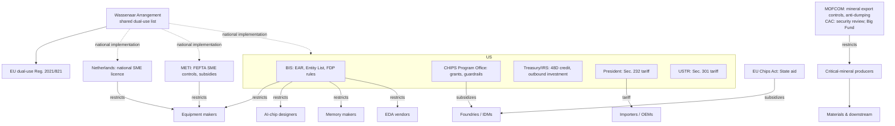

# Regulatory map: who sets the rules, and whom they hit

> Scope: regulators, policy instruments and voluntary standards by jurisdiction, mapped to the participant types they affect. Period: statuses as of the sources read (latest 2026-09); many measures are suspended or have scheduled step-ups, so **every status is dated and must be re-checked**. Geography: US, EU, Netherlands, Japan, China, South Korea, Taiwan, India, multilateral.
> Built from research unit RU-0001 (mainly the regulation and history lenses). Planner run `plan0-9c2e`. The instruments are also staged as `regulations` records in batch `PLAN0-plan0-9c2e`.

**Evidence status.** All claims are unverified (low confidence). The US, EU, Netherlands, Japan and China export-control claims rest mostly on tier-1 government texts. The Korea claims rest on tier-3 news only; Taiwan and several China status updates rest on tier-2/3 sources.

## What this means

Semiconductors are regulated less as a consumer product and more as a **strategic industry**. The rules fall into eight families [CLM-0364]:

1. export controls
2. subsidies and tax credits
3. tariffs and trade remedies
4. investment screening
5. critical-mineral controls
6. security reviews
7. chemical, environmental and disclosure rules
8. voluntary technical standards

## Why it matters

These rules decide:
- who may sell which tools and chips to whom
- where new fabs get built, because subsidies cover a large share of the cost
- what imports cost

Export controls hit different participants unevenly. The most exposed are equipment makers, AI-chip designers, HBM makers and fabs in China [CLM-0365]. Many 2025–26 measures are suspended or scheduled to step up, so their status changes month to month [CLM-0366].

## How it works

### By jurisdiction

| Jurisdiction | Authority | Instrument (status as dated) | Type | Main participant types affected | Claims |
|---|---|---|---|---|---|
| US | BIS (Commerce) | Oct 2022 advanced computing/SME rule, 87 FR 62186 (later amended) | export control | wafer-fab equipment makers, fabless AI designers, fabs in China, US persons | [CLM-0301] [CLM-0302] [CLM-0303] |
| US | BIS | Dec 2024 FDP/SME/HBM rule, 89 FR 96790 | export control | equipment makers, memory makers (HBM) | [CLM-0304] |
| US | BIS | Affiliates (50%) rule, Sept 2025; **suspended 10 Nov 2025 – 9 Nov 2026** | export control | all suppliers to listed entities | [CLM-0305] [CLM-0306] |
| US | BIS | H200-class chips to China: case-by-case from 15 Jan 2026, with conditions | export control | fabless AI-chip designers | [CLM-0307] [CLM-0308] |
| US | BIS | AI Diffusion Rule: **not enforced since May 2025; formal rescission not confirmed** | export control | AI-chip exporters | [CLM-0309] [CLM-0310] |
| US | BIS | GAAFET ECAD (EDA) software controls, Aug 2022 | export control | EDA vendors | [CLM-0409] |
| US | BIS | Entity List: Huawei (2019), plus 28 China entities in 2022 | export control | suppliers of US technology | [CLM-0135] [CLM-0303] |
| US | Congress / CHIPS Program Office (now under the Investment Accelerator) | CHIPS and Science Act 2022: US$52.7bn (US$39bn incentives, US$11bn R&D); milestone-based payment; some grants converted to equity | subsidy | IDMs, foundries, OSATs, equipment and materials makers | [CLM-0311] [CLM-0312] [CLM-0283] [CLM-0316] [CLM-0317] [CLM-0024] |
| US | NIST | Guardrails, 15 CFR 231: 10-year limit on expansion in countries of concern | rule | CHIPS recipients (IDMs, foundries) | [CLM-0313] [CLM-0028] |
| US | Congress / IRS | 26 USC 48D credit: 35% (25% before 2026); construction must start by end-2026; direct pay | tax credit | IDMs, foundries, equipment makers | [CLM-0314] [CLM-0315] [CLM-0280] [CLM-0281] (CON-0009 vs [CLM-0367]) |
| US | President | Section 232: 25% on certain advanced computing chips from 15 Jan 2026, with broad exemptions; **phase two signalled, not published** (tier-3) | tariff | importers, OEMs | [CLM-0319] [CLM-0320] [CLM-0321] [CLM-0322] |
| US | USTR | Section 301 China semiconductors: 0% from 23 Dec 2025, rising 23 Jun 2027 (rate TBA), on top of the existing 50% | tariff | Chinese chip exporters, US importers | [CLM-0323] [CLM-0324] |
| US | Treasury | Outbound Investment Security Program, from 2 Jan 2025 | investment screening | investors, Chinese chip firms | [CLM-0325] |
| US | SEC | Conflict minerals, Form SD | disclosure | listed manufacturers | [CLM-0326] |
| US | DoD DMEA | Trusted Supplier Program | accreditation | design, mask, foundry, packaging and test suppliers, brokers | [CLM-0458] [CLM-0459] |
| US | FTC | Merger review (blocked Nvidia–Arm, 2022) | competition | IP licensors, chip companies | [CLM-0120] |
| EU | Parliament, Council and Commission | Chips Act, Reg. 2023/1781, in force 21 Sept 2023; 18 State aid decisions, more than €32bn | regulation / State aid | IDMs, foundries, research organisations | [CLM-0327] [CLM-0328] [CLM-0329] [CLM-0141] |
| EU | Commission | Chips Act 2.0: **proposed 3 Jun 2026, not law** | regulation | whole chain | [CLM-0330] [CLM-0331] |
| EU | Commission (DG Trade) | Dual-use Reg. 2021/821, 2026 Annex I update adding SME, test equipment, materials and advanced ICs: **in scrutiny** | export control | equipment and materials makers, chip designers | [CLM-0332] [CLM-0343] |
| EU | Council + Parliament | Revised FDI screening (semiconductors in scope): **provisional agreement Dec 2025** | investment screening | investors, EU chip firms | [CLM-0333] |
| EU | ECHA / DG CLIMA | PFAS restriction (REACH); F-gas Reg. 2024/573: **effect on fabs unknown** | chemical | fabs, chemical and gas suppliers | [CLM-0334] [CLM-0335] |
| Netherlands | Minister for Foreign Trade and Development | National licence for advanced SME: DUV from 1 Sept 2023, extended 7 Sept 2024, metrology added 1 Apr 2025 | export control | wafer-fab equipment makers | [CLM-0336] [CLM-0337] [CLM-0338] |
| Japan | METI | FEFTA controls on 23 SME types (July 2023) | export control | wafer-fab equipment makers | [CLM-0339] |
| Japan | Government / METI | ¥10tn+ AI and semiconductor support by FY2030; Rapidus designation (company's own claim) | subsidy | foundries, IDMs | [CLM-0340] [CLM-0341] |
| China | MOFCOM + Customs | Gallium/germanium export licensing (1 Aug 2023) | mineral export control | critical-mineral producers, downstream buyers | [CLM-0344] [CLM-0345] |
| China | MOFCOM | Notice 2024 No. 46 US-specific ban: **suspended to 27 Nov 2026** | mineral export control | same | [CLM-0346] [CLM-0347] |
| China | MOFCOM | Notice 2025 No. 61 rare-earth 0.1% rule: **suspended to 10 Nov 2026** | mineral export control | producers; equipment and device makers using rare earths | [CLM-0348] [CLM-0349] |
| China | MOFCOM | Anti-dumping probe into US analog ICs (Sept 2025): **outcome unknown** | trade remedy | US analog IDMs | [CLM-0351] [CLM-0352] |
| China | Ministry of Finance + state investors | Big Fund III, CNY 344bn (May 2024) | state equity | chip companies | [CLM-0350] [CLM-0132] |
| China | Cybersecurity Review Office | Micron review (May 2023) | security review | foreign memory makers | [CLM-0353] |
| South Korea | National Assembly | K-Chips Act credit 20%/30% (Feb 2025); Semiconductor Special Act passed 29 Jan 2026, **in force not confirmed** (tier-3) | tax credit / act | IDMs, memory makers, foundries | [CLM-0354] [CLM-0355] |
| Taiwan | Legislative Yuan / MOEA | Art. 10-2 Statute for Industrial Innovation: 25% R&D credit, 5% equipment credit (tier-2) | tax credit | foundries, chip companies | [CLM-0356] |
| Taiwan | MOEA ITA | Entity list: 601 entities incl. Huawei and SMIC (June 2025) | export control | Taiwanese suppliers | [CLM-0357] |
| India | MeitY / ISM | Semicon India, ₹76,000 crore, up to 50% support; 10 projects approved; ISM 2.0 (₹1,000 crore FY27) | subsidy | fabs, OSAT/ATMP, designers, equipment and materials makers | [CLM-0358] [CLM-0359] [CLM-0360] |
| Multilateral | Wassenaar Arrangement (42 states) | Dual-use list, implemented nationally | control regime | equipment makers, chip companies | [CLM-0342] [CLM-0343] |
| Global (voluntary) | SEMI Standards | E30 GEM, E142, P39 OASIS and others | standard | equipment and materials makers, fabs, OSATs | [CLM-0361] [CLM-0362] [CLM-0453] [CLM-0454] |
| Global (voluntary) | JEDEC | DDR, LPDDR, HBM (HBM4, Apr 2025), flash, packaging | standard | memory makers, OSATs, OEMs | [CLM-0363] [CLM-0440] |

### By participant type (who is hit by what)

| Participant type | Instruments that bind or benefit it |
|---|---|
| `wafer_fab_equipment_maker` | US EAR 2022/2024, Dutch licence, Japan FEFTA, EU dual-use update, Wassenaar; 48D credit; SEMI Standards |
| `fabless_company` (AI chips) | US EAR 2022, H200 policy, AI Diffusion (status unknown); Section 232 (as importer of record, unclear); India design incentives |
| `memory_maker` | EAR HBM controls; China CAC review; K-Chips credit; JEDEC |
| `foundry` / `idm` | CHIPS grants + guardrails, 48D, EU Chips Act State aid, Japan, Korea, Taiwan and India incentives; China Big Fund; EU PFAS/F-gas (unknown effect) |
| `osat` | CHIPS eligibility (advanced packaging); India ATMP support; DMEA trusted suppliers |
| `eda_vendor` | GAAFET ECAD controls |
| `critical_mineral_producer`, `materials_supplier` | China mineral controls; EU dual-use (materials); ISM 2.0 |
| `oem` / importers | Section 232 and 301 tariffs; conflict minerals |
| `capital_provider` | US outbound program; EU FDI screening |

Mapping participant types to instruments is partly an interpretation by the regulation lens [CLM-0365].

## Historical context

Trade and industrial policy has been a feature of this industry from early on:
- the 1986 US–Japan Semiconductor Arrangement [CLM-0099]
- the 100% Section 301 tariffs of 1987 [CLM-0100]
- SEMATECH in 1987 [CLM-0102]
- China's Big Fund from 2014 [CLM-0131]
- the Huawei Entity Listing in 2019 [CLM-0135]
- Japan's 2019 materials curbs on Korea [CLM-0136]

The history lens's reading is that each wave followed a perceived competitive or security threat [CLM-0149] (interpretation).

## What we still don't know

- **CHIPS awards after 2025.** Totals and renegotiated terms. Up to US$30.7bn was awarded by January 2025 [CLM-0284]; the later deals and any equity terms are open (INT-0011, RU-0026).
- **The 48D rate.** The statute says 35% but the NIST fact sheet says 25% (CON-0009). This is probably a timing difference and needs to be confirmed.
- **Formal rescission of the AI Diffusion Rule** [CLM-0309]. **Section 232 phase two** [CLM-0322].
- **Entry into force** of Chips Act 2.0, the EU dual-use update, EU FDI screening and Korea's Special Act.
- **EU PFAS and F-gas treatment of fab uses** [CLM-0334] [CLM-0335] (INT-0012).
- **Outcome of China's anti-dumping probe** [CLM-0352]. The primary MOFCOM texts were not read; the evidence comes through translations and tier-3 sources.
- **Primary legal texts for Korea and Taiwan.** Taiwan's N-1 overseas technology rule and its national core technologies list were not researched.
- **Rule areas not covered yet.** CFIUS, US state permitting and water rules, and export controls in Korea, Singapore, Malaysia and Israel. The standards bodies IEC TC47, AEC (automotive) and ISO/IEEE (RU-0033).
- **Real-world licence outcomes.** Licence approval times and rates (INT-0010).
