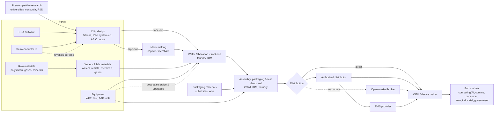

# Value chain: how a chip gets from sand to a product

> Scope: the stages of the semiconductor value chain, who operates each one, and the intermediaries between them. Period: current structure as of 2026-09-29; shares and sizes carry their own year (several are 2019–2021 and are historical). Geography: global.
> Built from research unit RU-0001 (value-chain, technology, definition and money lenses). Planner run `plan0-9c2e`.

**Evidence status.** Every cited claim is unverified (low confidence) until fact-checked. Links marked **unknown** were not evidenced and have not been filled in by assumption.

## What this means

A chip passes through three big stages:
1. **Design.** Engineers draw the circuit using software.
2. **Front-end fabrication.** A fab builds the circuit onto a silicon wafer.
3. **Back end (assembly, packaging and test).** The wafer is cut into individual chips, each chip is sealed in a package, and the chips are tested [CLM-0368] [CLM-0467].

Around these three sit research, suppliers of raw materials, wafers, equipment and software, mask makers, distributors, board assemblers and device makers. US Commerce regulation names the manufacturing part as three stages: wafer production, fabrication and packaging [CLM-0027].

## Why it matters

Each stage has different economics and different geography:
- **Design** is about 53% of value added and 65% of R&D [CLM-0476] [CLM-0477].
- **Wafer fabrication** is about 65% of capital spending [CLM-0478]. One fab costs roughly US$5–20bn [CLM-0481].
- **Back-end capacity** is at least 81% in Asia [CLM-0536].

These figures are 2019–2022 estimates. SIA/BCG counted more than 50 points in the chain where one region holds over 65% of the market [CLM-0546].

## How it works

### Stage by stage

| # | Stage | What happens | Who does it (ontology type) | Key evidence |
|---|---|---|---|---|
| 1 | Pre-competitive research | Basic and shared R&D | `research_organisation`, company labs | About US$90bn industry R&D in 2019 [CLM-0479]. SEMATECH [CLM-0102], ITRI [CLM-0104], imec [CLM-0438] |
| 2 | Raw materials | Polysilicon, gases such as neon, and minerals such as gallium and germanium | `wafer_supplier`, `specialty_gas_supplier`, `critical_mineral_producer` | 4 firms hold more than 90% of semiconductor-grade polysilicon (2021 est.) [CLM-0523]. Neon is recovered from air separation and then purified [CLM-0533]. China produced about 90% of gallium in 2022 [CLM-0345] |
| 3 | Wafers and fab materials | Ingots are sliced and polished into wafers. Resists, wet chemicals and gases are supplied to fabs | `wafer_supplier`, `process_chemical_supplier`, `specialty_gas_supplier` | 12,973 MSI of wafers shipped in 2025 [CLM-0522]. Fab materials were US$45.8bn in 2025 [CLM-0520]. Wafers are sliced from ingots [CLM-0375] |
| 4 | Equipment | More than 50 tool types. Service and spare parts continue after the sale | `wafer_fab_equipment_maker`, `test_equipment_maker` | US$135.1bn in 2025 [CLM-0057] [CLM-0472]. Installed-base sales were about 25% of ASML's 2025 sales [CLM-0567] |
| 5 | EDA and IP | Design software and licensable design blocks | `eda_vendor`, `ip_licensor` | ESD revenue was US$5.47bn in Q4 2025 [CLM-0062]. US firms held about 96% of EDA in 2019 [CLM-0497] |
| 6 | Chip design | Specification, then logic design, physical design and verification. Ends in **tape-out**, when the finished layout is handed over | `fabless_company`, `idm`, `custom_silicon_system_company`, `design_service_provider` | Design steps [CLM-0469]. RTL-to-GDSII flow [CLM-0417]. A leading SoC can cost more than US$1bn to develop (2019-era estimate) [CLM-0413] |
| 7 | Mask making | Layout data become a set of photomasks, one per layer | `mask_maker` (captive or merchant) | [CLM-0424] [CLM-0425] [CLM-0527]. The first layers are sometimes needed within 24 hours [CLM-0426] |
| 8 | Wafer fabrication (front end) | Deposition, lithography, etch and implant loops: 400–1,400 steps, up to about 100 layers | `foundry`, `idm` | [CLM-0371] [CLM-0374] [CLM-0376]. Foundries hold about 35% of capacity (2021 est.) [CLM-0487] |
| 9 | Assembly, packaging and test (back end) | Wafer sort, dicing, packaging (including advanced 2.5D/3D), final test and system-level test | `osat`, `idm`, `foundry`; inputs from `packaging_materials_supplier` | [CLM-0470] [CLM-0539] [CLM-0444]. At least 81% of capacity is in Asia [CLM-0536] |
| 10 | Distribution | Chips go direct to buyers, or through authorized distributors. The open market is a secondary channel | `authorized_distributor`, `open_market_broker` | [CLM-0541] [CLM-0544]. TI sold more than 80% direct in 2025 [CLM-0245]; Microchip sold 45% through distributors in FY2025 [CLM-0274] |
| 11 | System integration | Chips are mounted on boards and built into products | `ems_provider`, `oem` | EMS was about 40% of ASE's 2025 revenue [CLM-0535] |
| 12 | End markets | Final demand | `end_market` types | Computing/AI was 34.9% in 2024 [CLM-0560]; automotive 9.9% [CLM-0561] |
| 13 | Post-sale | Equipment service and upgrades; royalties on chips already shipped | `equipment_maker`, `ip_licensor` | ASML installed-base sales were €8.2bn in 2025 [CLM-0509]. Arm royalties were US$2.61bn in FY2026 [CLM-0215] |

### Intermediaries (the "hidden" layers)

- **Design-service houses.** They manage the foundry and back-end work for their customers. In the one case evidenced, the foundry owns part of the house [CLM-0504] [CLM-0505].
- **Mask shops** stand between design and fab. Chipmakers run their own (captive) shops but also buy from independent (merchant) shops [CLM-0527].
- **Gas purifiers** stand between air-separation plants and fabs [CLM-0533].
- **Authorized distributors** stand between chipmakers and OEM/EMS buyers. They add design support and programming [CLM-0541].
- **Brokers and online exchanges** form the open market. This is where counterfeits can enter [CLM-0544] [CLM-0545].
- **Foundry "Foundry 2.0" boundary.** TSMC now counts packaging, testing and mask-making as part of the foundry industry [CLM-0064]. This means the boundary between stages 7–9 is moving.

## Evidence: where the chain is concentrated

| Point | Concentration | Period | Claim |
|---|---|---|---|
| EUV lithography scanners | One supplier | 2019–2025 | [CLM-0506] [CLM-0507] |
| EDA software | US firms about 96% | 2019 | [CLM-0497] |
| Sub-10nm logic capacity | Taiwan 92%, Korea 8% | about 2019–2020 | [CLM-0548] |
| Foundry revenue (top 10) | TSMC 72.5% | 2Q26 | [CLM-0553] (contradiction CON-0012 with the 2020 figure of 54% [CLM-0552]; the two measure different populations) |
| DRAM revenue | Top 3 about 87.6% | 2Q26 | [CLM-0557] (inference) |
| Semiconductor-grade polysilicon | Top 4 more than 90% | about 2020 | [CLM-0523] |
| Photoresist | Listed producers all Japanese | 2021 | [CLM-0524] |
| ATP capacity | Mainland China + Taiwan more than 60% | about 2020 | [CLM-0537] |
| IC substrates | Japan, Korea and Taiwan about 69% | about 2021 | [CLM-0540] |
| Neon | Ukraine about 50% (USITC) or about 70% (TrendForce) | 2022 | [CLM-0531] [CLM-0532] (CON-0011) |

## What we still don't know

| Gap | Status | Where it is tracked |
|---|---|---|
| Value added and capacity shares by stage and region after 2019 | **unknown** [CLM-0571] | RU-0047 |
| Share of chip sales sold direct vs through distributors | **unknown** [CLM-0570] | INT-0018, RU-0043 |
| Firm-level shares of wafer suppliers | **unknown** [CLM-0569] | RU-0041 |
| Specialised logistics (wafers, masks, hazardous gases, EUV tool moves) | **unknown** [CLM-0568] | INT-0021, RU-0046 |
| Custom silicon: which foundries and design houses build hyperscaler chips | **unknown**. The designers are evidenced [CLM-0502]; the manufacturing link is not | RU-0045 |
| Share of masks made in-house vs by merchant shops at the leading edge | **unknown** | INT-0020 |
| Cost and lead time of a leading-edge mask set | **unknown** [CLM-0428] | INT-0015 |
| How long a chip takes to make: about 12 weeks of fab cycle time vs up to 4 months from design to mass production | Contradiction CON-0010 [CLM-0372] [CLM-0373]; probably two different measures | RU-0035 |
| Who does advanced packaging, foundries or OSATs, and in what split | Both are evidenced [CLM-0539]; the split is **unknown** | RU-0044 |
